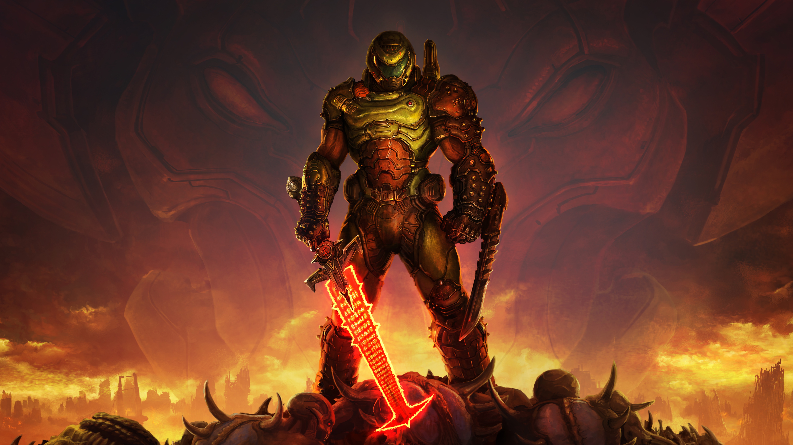

<!DOCTYPE html>
<html lang="en">

<head>

  <meta charset="utf-8">
  <meta name="viewport" content="width=device-width, initial-scale=1, shrink-to-fit=no">
  <meta name="description" content="">
  <meta name="author" content="">

  <title>reBandit - World Premium Gaming Site</title>

  <!-- Bootstrap core CSS -->
  <link href="vendor/bootstrap/css/bootstrap.min.css" rel="stylesheet">

  <!-- Custom styles for this template -->
  <link href="css/shop-homepage.css" rel="stylesheet">

</head>

<body>

  <!-- Navigation -->
  <nav class="navbar navbar-expand-lg navbar-dark bg-dark fixed-top">
    

      <a class="navbar-brand" href="#">reBandit</a>
      <button class="navbar-toggler" type="button" data-toggle="collapse" data-target="#navbarResponsive" aria-controls="navbarResponsive" aria-expanded="false" aria-label="Toggle navigation">
        
      </button>
      

        <ul class="navbar-nav ml-auto">
          <li class="nav-item active">
            <a class="nav-link" href="#">Home
              (current)
            </a>
          </li>
          <li class="nav-item">
            <a class="nav-link" href="#">About</a>
          </li>
          <li class="nav-item">
            <a class="nav-link" href="#">Services</a>
          </li>
          <li class="nav-item">
            <a class="nav-link" href="#">Contact</a>
          </li>
        </ul>
      

    

  </nav>

  <!-- Page Content -->
  

    

      

        <h2 class="my-4">Home to the World's Top Online Games</h2>

        

          

            

              <a class="card-link" data-toggle="collapse" href="#collapseOne">
                

                  <h5>Weekly Top 10</h5>
                

              </a>
              
              

                

                  

                    
Tennis 3D

                  

                

              

            

            

              <a class="card-link" data-toggle="collapse" href="#collapseFour">
                

                  <h5>Top Featured Games</h5>
                

              </a>
              
              

                

                  

                    
Tennis 3D

                  

                

              

            

            

              <a class="card-link" data-toggle="collapse" href="#collapseTwo">
                

                  <h5>Popular Games</h5>
                

              </a>
              
              

                

                  

                    
Tennis 3D

                  

                

              

            

            

              <a class="card-link" data-toggle="collapse" href="#collapseThree">
                

                  <h5>Game Categories</h5>
                

              </a>
              
              

                

                  

                    
Classic

                    
Sports

                    
Board

                    
Racing

                  

                

              

            

          

        
 <!-- card -->
        

        <h2>Sponsored Games</h2>

        

            

              
              

                <h4 class="card-title">
                  <a href="#">Optimus: Dark Of The Moon</a>
                </h4>
                <h5>FREE</h5>
                
Lorem ipsum dolor sit amet, consectetur adipisicing elit. Amet numquam aspernatur!

              

              

                <small class="text-muted">&#9733; &#9733; &#9733; &#9733; &#9734;</small>
              

            

          

      

      <!-- /.col-lg-3 -->

      

        

          <ol class="carousel-indicators">
            <li data-target="#carouselExampleIndicators" data-slide-to="0" class="active"></li>
            <li data-target="#carouselExampleIndicators" data-slide-to="1"></li>
            <li data-target="#carouselExampleIndicators" data-slide-to="2"></li>
          </ol>
          

            

              
            

            

              
            

            

              
            

          

          <a class="carousel-control-prev" href="#carouselExampleIndicators" role="button" data-slide="prev">
            
            Previous
          </a>
          <a class="carousel-control-next" href="#carouselExampleIndicators" role="button" data-slide="next">
            
            Next
          </a>
        

        

        

          
        

        

        

          

            

              
              

                <h4 class="card-title">
                  <a href="#">Tennis 3D</a>
                </h4>
                <h5>FREE</h5>
                
Lorem ipsum dolor sit amet, consectetur adipisicing elit. Amet numquam aspernatur!

              

              

                <small class="text-muted">&#9733; &#9733; &#9733; &#9733; &#9734;</small>
              

            

          

          

            

              
              

                <h4 class="card-title">
                  <a href="#">Zuma Deluxe</a>
                </h4>
                <h5>FREE</h5>
                
Lorem ipsum dolor sit amet, consectetur adipisicing elit. Amet numquam aspernatur! Lorem ipsum dolor sit amet.

              

              

                <small class="text-muted">&#9733; &#9733; &#9733; &#9733; &#9734;</small>
              

            

          

          

            

              
              

                <h4 class="card-title">
                  <a href="#">Street Racing</a>
                </h4>
                <h5>FREE</h5>
                
Lorem ipsum dolor sit amet, consectetur adipisicing elit. Amet numquam aspernatur!

              

              

                <small class="text-muted">&#9733; &#9733; &#9733; &#9733; &#9734;</small>
              

            

          

          

            

              
              

                <h4 class="card-title">
                  <a href="#">Baller</a>
                </h4>
                <h5>FREE</h5>
                
Lorem ipsum dolor sit amet, consectetur adipisicing elit. Amet numquam aspernatur!

              

              

                <small class="text-muted">&#9733; &#9733; &#9733; &#9733; &#9734;</small>
              

            

          

          

            

              
              

                <h4 class="card-title">
                  <a href="#">Color Glitch</a>
                </h4>
                <h5>FREE</h5>
                
Lorem ipsum dolor sit amet, consectetur adipisicing elit. Amet numquam aspernatur! Lorem ipsum dolor sit amet.

              

              

                <small class="text-muted">&#9733; &#9733; &#9733; &#9733; &#9734;</small>
              

            

          

          

            

              
              

                <h4 class="card-title">
                  <a href="#">Optimus: Dark Of The Moon</a>
                </h4>
                <h5>FREE</h5>
                
Lorem ipsum dolor sit amet, consectetur adipisicing elit. Amet numquam aspernatur!

              

              

                <small class="text-muted">&#9733; &#9733; &#9733; &#9733; &#9734;</small>
              

            

          

        

        <!-- /.row -->

      

      <!-- /.col-lg-9 -->

    

    <!-- /.row -->

  

  <!-- /.container -->

<!--   

 <iframe id="ViostreamIframe"
  width="100%" height="200%"
  src="https://wanted5games.com/games/html5/funny-hair-salon-new-en-s-iga-cloud/index.html?pub=10"
  frameborder="0" allowfullscreen=""
  style="position:absolute; top:0; left: 0"></iframe>

 -->

  <!-- Footer -->
  <footer class="py-5 bg-dark">
    

      
Copyright &copy; reBandit 2020

    

    <!-- /.container -->
  </footer>

  <!-- Bootstrap core JavaScript -->
  
  

</body>

</html>
